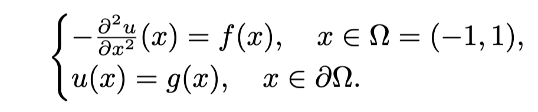
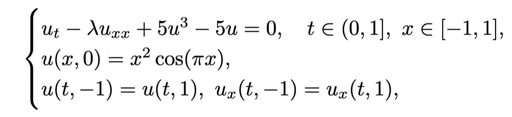
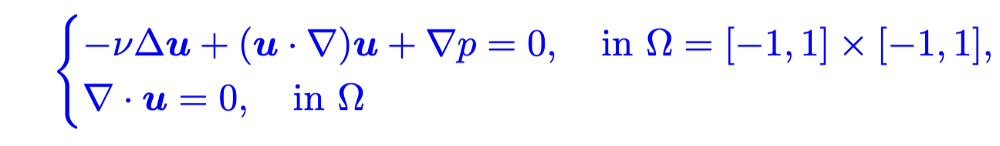
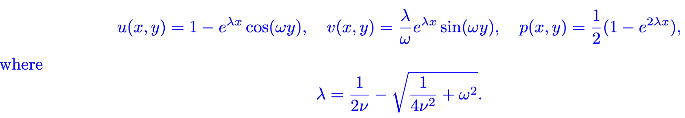
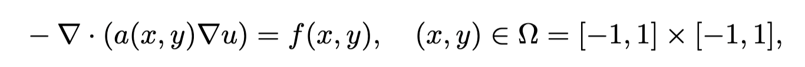

# ParticleWNN: a novel weak form DNN-based method for solving PDE forward and inverse problems

This repository is the official implementation of the [ParticleWNN](https://arxiv.org/abs/2305.12433).

**NOTE:** <font color='blue'>A more recent implementation of the ParticleWNN method is available in a dedicated repository: [PhysicsDriven-DL4PDEs](https://github.com/yaohua32/PhysicsDriven-DL4PDEs/tree/main). This updated version is more user-friendly, easier to follow, and includes a broader range of PDE examples.</font>

## Table of Contents

- [ParticleWNN: a novel weak form DNN-based method for solving PDE forward and inverse problems](#particlewnn-a-novel-weak-form-dnn-based-method-for-solving-pde-forward-and-inverse-problems)
  - [Table of Contents](#table-of-contents)
  - [Introduction](#introduction)
  - [Usage](#usage)
    - [Prerequisites](#prerequisites)
    - [How to use?](#how-to-use)
      - [Step 1: Define the Problem](#step-1-define-the-problem)
      - [Step 2: Setup the Solver](#step-2-setup-the-solver)
      - [Step 3: Set parameters and solve the problem](#step-3-set-parameters-and-solve-the-problem)
  - [Examples](#examples)
    - [The 1d Poisson's Problem](#the-1d-poissons-problem)
    - [The Allen-Cahn Problem](#the-allen-cahn-problem)
    - [The steady NS Problem](#the-steady-ns-problem)
    - [The 2d Inverse Problem](#the-2d-inverse-problem)
  - [References](#references)

## Introduction

The ParticleWNN is a deep neural network framework based on the weak form of PDE for solving PDE-based forward and inverse problems. The novelty of the framework is to employ test functions compactly supported in extremely small regions. The sizes and locations of these support regions can be selected arbitrarily. In this way, the method not only inherits the advantages of weak-form methods such as requiring less regularity of the solution and a small number of quadrature points for computing the integrals, but also outperforms them in solving complicated solution problems.

## Usage

### Prerequisites

- Python=3.9.10
- PyTorch=1.10.1
- Scipy=1.7.3

### How to use?

#### Step 1: Define the Problem

Defining your problem by following the examples in the 'Problems/' directory and save it within the same directory. If you have data that needs to be loaded during the training process, such as observation data or ground truth data obtained from high-precision methods, please place it in the 'Problems/data/' directory.

In the problem definition file (usually a .py file named after the problem), you usually need to define the following functions:

- Residuals of PDE
- Initial and/or boundary conditions
- Observations in the inverse problem
- Optional: Exact solution obtained by high-precision methods for calculating errors

#### Step 2: Setup the Solver

Solvers for different types of problems are placed in the ‘Solvers’ folder. You can choose the solvers that fit your problem or modify them to suit your needs.

Solvers that contained in the 'Solvers' folder:

- ```ParticelWNN.py```: ParticleWNN Solver for basic time-independent PDE problems.  
- ```ParticleWNN_Time.py```: ParticleWNN Solver for time-dependent PDE problems.
- ```ParticleWNN_Inverse.py```: ParticleWNN Solver for inverse problems.
- ```ParticleWNN_NS_Steady.py```: ParticleWNN solver for steady NS problems.

#### Step 3: Set parameters and solve the problem

Configuring the parameters for the problem and solver in the file 'main.py'. For parameters for the problem, the key settings involve specifying the type of the test function and the parameters in the problem. The default test function is 'Wendland,' but you can also select 'Bump' or 'Cosine.' If needed, you can define your custom test functions, and for more details, please refer to the 'TestFun_ParticleWNN.py' file in the 'Utils' directory.

For the solver, you will configure the neural network model, collocation points and/or integration points, learning rate, and more. An example configuration for a basic time-independent solver is as follows:

```python
kwargs = {  'N_particle': 200,     # The number of particles
            'N_bd_each_face': 1,   # The number of collocation points on the boundary (each face).
            'N_int': 50,           # The numer of integration points or meshsize (if the integration method is 'mesh')
            'R_max': 1e-4,         # The upper bound of the R-max
            'R_min': 1e-6,         # The lower bound of the R-min
            'maxIter': 20000,      # The maximum iterations
            'lr': lr,              # The learning rate
            'model_type': 'FeedForward_Sin', # The type of network structure
            'data_type': {'numpy':self.np_type, 'torch':self.torch_type},  
            'lr_Decay': 2.,        # The Decay rate 
            'loss_weight': {'eq':1., 'bd':5.}, # The weight of each loss 
            'topK': 150,           
            'int_method': 'mesh',  # The integration method
            'hidden_width': 50,    # The neurons in each layer of the DNN
            'hidden_layer': 3,     # The layers of the DNN
            'activation': 'tanh',  # The activation function
            }
```

## Examples

### The 1d Poisson's Problem

- The PDE of the 1d Poisson's problem 
- Run the file ```main_poisson_1d.py```

<center> 
 
 </center>

### The Allen-Cahn Problem

- The mathematics model of the Allen-Cahn Problem: 
- Run the file ```main_allen_cahn_1d.py```

<center> 
 
</center>

### The steady NS Problem

- In non-dimensional form, the mathematical model is given as:
    
    where $\nu$ indicates the viscosity coefficient; $\bm{u}=(u,v)$ and $p$ are the velocity field and the pressure field, respectively. This equation has the following analytical solution: 
- Run the file ```main_NS_Kovasznay_2d.py```

<center>
  
</center>

### The 2d Inverse Problem

- The mathematics model of the inverse problem:
    where $u$ is the solution of the equation, $f$ indicates the source term, and $a$ represents the coefficient. Given the source term $f$, the inverse problem is to identify the coefficient $a$ with inexact measurements $u^{\delta}$
where $\delta$ indicates Gaussian noise.
- Run the file ```main_inverse_poisson_2d.py```
  
<center>
   
</center>

## References

- [ParticleWNN: a Novel Neural Networks Framework for Solving Partial Differential Equations](https://arxiv.org/abs/2305.12433)
